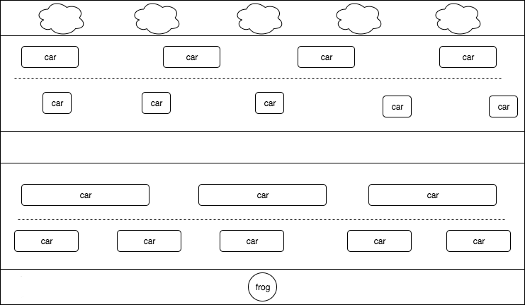

## Frogger

### Background

Frogger is an arcade game developed in 1981 by Konami. The objective of the game is to navigate frogs safely across a busy road without being hit by a motor vehicle.

### Functionality & MVP Features

- [ ] Navigate the frog around the board
- [ ] Vehicles moving at different speeds on the road
- [ ] Check for colliding objects
- [ ] A production README

### Wireframes

### Technologies

- Vanilla JavaScript for overall structure and game logic
- `Easel.js` with `HTML5 Canvas` for DOM manipulation and rendering
- Webpack to bundle and serve up the various scripts.

### Architecture

- `game_view.js`: game instance, canvas context
- `game.js`: moves the objects, checks for collisions, draws the game, keeps track of frog lives
- `cars.js`: car objects
- `frog.js`: frog object
- `moving_object.js`: base class for moving objects

### Implementation Timeline

**Day 1**: Setup Node modules, set up webpack and `Easel.js`. Learn `HTML5 Canvas` and look into using `Easel.js`. Render game board, create safe zone and traffic zone.

**Day 2**: Create and render the moving cars. Have cars in different lanes move at different speeds. The top lanes can move left to right, bottom lanes move right to left. Wrap the cars around the screen.

**Day 3**: Create and render the frog. Allow users to move the frog up, down, right, left with arrow keys. Add collision detection.

**Day 4**: Add win/lose logic, frog lives tracking. Style the frontend.

### Bonus features

- Frog homes
- Multiple levels
